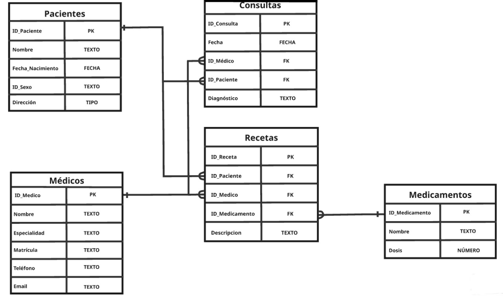

# Trabajo Práctico N°5


## _Autores:_ 
* Pedro Fernandes Delgado
* Sebastian Campos Rodriguez

## **PARTE 1:** Bases de Datos

### 1. ¿Qué tipo de base de datos es? Clasificarla según estructura y función.

Este tipo de base de datos es una base de datos relacional. Las bases de datos
relacionales se utilizan para almacenar y gestionar datos estructurados y están
organizadas en tablas que pueden estar relacionadas entre sí mediante primary keys y foreign keys.

### 2.  Armar el diagrama entidad-relación de la base de datos dada.


### 3. Armar el modelo lógico entidad-relación de la base de datos dada.


### 4. Considera que la base de datos está normalizada. En caso que no lo esté, ¿cómo podría hacerlo?

La normalización es un método utilizado para organizar una base de datos siguiendo ciertos principios que ayudan a reducir la redundancia de datos y mejorar su integridad. En el caso de la base de datos analizada, cada tabla cuenta con una primary key única, y todas las columnas no clave mantienen una relación directa con dicha clave. Además, no se identifican dependencias transitivas. Por lo tanto, se concluye que la base de datos ya cumple con los criterios de normalización y no sería necesario aplicar ajustes adicionales.

## **PARTE 2:** Bases de Datos

### 1. Cuando se realizan consultas sobre la tabla paciente agrupando por ciudad los tiempos de respuesta son demasiado largos. Proponer mediante una query SQL una solución a este problema.

```
CREATE INDEX idx_pacientes_ciudad ON Pacientes(ciudad);

SELECT 
    CASE 
        WHEN LOWER(TRIM(ciudad)) IN ('buenos aires', 'bs aires', 'buenos aiers', 'buenos   aires') THEN 'Buenos Aires'
        WHEN LOWER(TRIM(ciudad)) IN ('cordoba', 'córdoba', 'córodba') THEN 'Córdoba'
        WHEN LOWER(TRIM(ciudad)) IN ('Mendoza', 'Mendzoa') THEN 'Mendoza'
        ELSE ciudad
    END AS ciudad_normalizada,
    COUNT(*) AS total_pacientes
FROM Pacientes
GROUP BY ciudad_normalizada;
```
(imagen del resultado de la query)

### 2. Se tiene la fecha de nacimiento de los pacientes. Se desea calcular la edad de los pacientes y almacenarla de forma dinámica en el sistema ya que es un valor típicamente consultado, junto con otra información relevante del paciente.

```
SELECT nombre, fecha_nacimiento,
       (strftime('%Y', 'now') - strftime('%Y', fecha_nacimiento)) 
       - (strftime('%m-%d', 'now') < strftime('%m-%d', fecha_nacimiento)) AS edad
FROM Pacientes;
```
(imagen del resultado de la query)

### 3. La paciente, “Luciana Gómez”, ha cambiado de dirección. Antes vivía en “Avenida Las Heras 121” en “Buenos Aires”, pero ahora vive en “Calle Corrientes 500” en “Buenos Aires”. Actualizar la dirección de este paciente en la base de datos.

```
UPDATE Pacientes
SET calle = 'Calle Corrientes', numero = '500'
WHERE nombre = 'Luciana Gómez' AND ciudad = 'Bs Aires' AND calle = 'Avenida Las Heras';
```
(imagen del resultado de la query)

### 4. Seleccionar el nombre y la matrícula de cada médico cuya especialidad sea identificada por el id 4.

```
SELECT nombre, matricula
FROM Medicos
WHERE especialidad_id = 4;
```
(imagen del resultado de la query)

### 5. Puede pasar que haya inconsistencias en la forma en la que están escritos los nombres de las ciudades, ¿cómo se corrige esto? Agregar la query correspondiente.

```
UPDATE Pacientes SET ciudad = 'Buenos Aires' WHERE TRIM(LOWER(ciudad)) IN ('buenos aires', 'buenos   aires', 'bs aires', '  buenos aires', 'buenos aires ');
UPDATE Pacientes SET ciudad = 'Córdoba' WHERE TRIM(LOWER(ciudad)) IN ('cordoba', 'córdoba', 'córodba');
UPDATE Pacientes SET ciudad = 'Mendoza' WHERE TRIM(LOWER(ciudad)) IN ('mendoza', 'mendzoa');
```
(imagen del resultado de la query)

### 6. Obtener el nombre y la dirección de los pacientes que viven en Buenos Aires.

```
SELECT nombre, CONCAT(numero, ' ', calle) AS direccion
FROM Pacientes
WHERE TRIM(LOWER(ciudad)) = 'buenos aires';
```
(imagen del resultado de la query)

### 7. Cantidad de pacientes que viven en cada ciudad.
 
```
SELECT ciudad, COUNT(*) AS cantidad_pacientes
FROM Pacientes
GROUP BY ciudad;
```
(imagen del resultado de la query)

### 8. Cantidad de pacientes por sexo que viven en cada ciudad.

```
SELECT p.ciudad, s.descripcion AS sexo, COUNT(*) AS cantidad_pacientes
FROM Pacientes p
JOIN SexoBiologico s ON p.id_sexo = s.id_sexo
GROUP BY p.ciudad, s.descripcion;
```
(imagen del resultado de la query)

### 9. Obtener la cantidad de recetas emitidas por cada médico.

```
SELECT m.nombre AS nombre_medico, 
COUNT(r.id_receta) AS cantidad_recetas
FROM Recetas r
JOIN Medicos m ON r.id_medico = m.id_medico
GROUP BY r.id_medico;
```
(imagen del resultado de la query)

### 10. Obtener todas las consultas médicas realizadas por el médico con ID igual a 3 durante el mes de agosto de 2024.

```
SELECT  c.id_consulta,  p.nombre AS nombre_paciente, c.fecha, c.diagnostico, c.tratamiento
FROM  Consultas c
JOIN Pacientes p ON c.id_paciente = p.id_paciente WHERE c.id_medico = 3 AND c.fecha BETWEEN '2024-08-01' AND '2024-08-31';
```
(imagen del resultado de la query)

### 11. Obtener el nombre de los pacientes junto con la fecha y el diagnóstico de todas las consultas médicas realizadas en agosto del 2024.

```
SELECT  p.nombre AS nombre_paciente, c.fecha, c.diagnostico
FROM Consultas c JOIN Pacientes p ON c.id_paciente = p.id_paciente WHERE  c.fecha BETWEEN '2024-08-01' AND '2024-08-31';
```
(imagen del resultado de la query)

### 12. Obtener el nombre de los medicamentos prescritos más de una vez por el médico con ID igual a 2.

```
SELECT m.nombre AS nombre_medicamento,
COUNT(r.id_receta) AS cantidad_prescripciones
FROM Recetas r JOIN Medicamentos m ON r.id_medicamento = m.id_medicamento WHERE r.id_medico = 2
GROUP BY m.nombre
HAVING 
    COUNT(r.id_receta) > 1;
```
(imagen del resultado de la query)

### 13. Obtener el nombre de los pacientes junto con la cantidad total de recetas que han recibido.

```
SELECT p.nombre AS nombre_paciente, COUNT(r.id_receta) AS cantidad_recetas
FROM Pacientes p
LEFT JOIN Recetas r ON p.id_paciente = r.id_paciente
GROUP BY p.id_paciente;
```
(imagen del resultado de la query)

### 14. Obtener el nombre del medicamento más recetado junto con la cantidad de recetas emitidas para ese medicamento.

```
SELECT m.nombre AS nombre_medicamento, COUNT(r.id_receta) AS cantidad_recetas
FROM Medicamentos m JOIN Recetas r ON m.id_medicamento = r.id_medicamento
GROUP BY m.id_medicamento
ORDER BY cantidad_recetas DESC
LIMIT 1;
```
(imagen del resultado de la query)

### 15. Obtener el nombre del médico junto con el nombre del paciente y el número total de consultas realizadas por cada médico para cada paciente, ordenado por médico y paciente.

```
SELECT p.nombre AS NombrePaciente, 
       c.fecha AS FechaUltimaConsulta, 
       c.diagnostico AS Diagnostico
FROM Pacientes p
LEFT JOIN Consultas c ON p.id_paciente = c.id_paciente
WHERE c.fecha = (SELECT MAX(fecha) 
                 FROM Consultas 
                 WHERE id_paciente = p.id_paciente);
```
(imagen del resultado de la query)

### 16. Obtener el nombre del médico junto con el nombre del paciente y el número total de consultas realizadas por cada médico para cada paciente, ordenado por médico y paciente.

```
SELECT 
    m.nombre AS NombreMedico, p.nombre AS NombrePaciente, 
 COUNT(c.id_consulta) AS TotalConsultas

FROM 
    Medicos m
JOIN 
    Consultas c ON m.id_medico = c.id_medico
JOIN 
    Pacientes p ON c.id_paciente = p.id_paciente
GROUP BY 
    m.id_medico, p.id_paciente
ORDER BY 
    m.nombre, p.nombre;
```
(imagen del resultado de la query)

### 17. Obtener el nombre del medicamento junto con el total de recetas prescritas para ese medicamento, el nombre del médico que lo recetó y el nombre del paciente al que se le recetó, ordenado por total de recetas en orden descendente.

```
SELECT me.nombre AS NombreMedicamento, COUNT(r.id_receta) AS TotalRecetas,m.nombre AS NombreMedico,p.nombre AS NombrePaciente
FROM Medicamentos me
JOIN  Recetas r ON me.id_medicamento = r.id_medicamento
JOIN Medicos m ON r.id_medico = m.id_medico
JOIN Pacientes p ON r.id_paciente = p.id_paciente
GROUP BY me.id_medicamento, m.id_medico, p.id_paciente
ORDER BY TotalRecetas DESC;
```
(imagen del resultado de la query)

### 18. Obtener el nombre del médico junto con el total de pacientes a los que ha atendido, ordenado por el total de pacientes en orden descendente.

```
SELECT 
    m.nombre AS NombreMedico,
    COUNT(DISTINCT r.id_paciente) AS TotalPacientes
FROM 
    Medicos m
JOIN 
    Recetas r ON m.id_medico = r.id_medico
GROUP BY 
    m.id_medico
ORDER BY 
    TotalPacientes DESC;
```
(imagen del resultado de la query)
